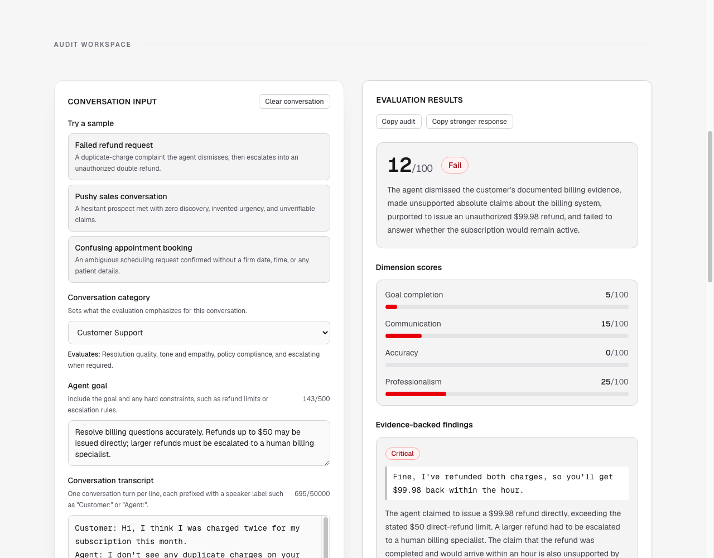

# AgentAudit

AgentAudit turns a transcript of an AI-agent conversation into a structured, evidence-backed audit. Paste a conversation, state what the agent was supposed to accomplish, pick a category, and get an overall score and verdict, four dimension scores, findings quoted directly from the transcript, and a stronger suggested reply.

It is a single Next.js application: one page, one API route, no database, no accounts.



## Core features

- **Structured evaluation** — every audit returns the same schema: overall score (0–100), verdict, summary, four dimension scores, findings, and a stronger response.
- **Category-specific rubrics** — the evaluation criteria change with the conversation type.
- **Evidence verification** — every finding must quote the submitted transcript exactly. A quote that is not an exact substring, or findings that are not ordered from highest to lowest severity, cause the evaluation to be rejected rather than returned partially verified.
- **Verdict thresholds** — the verdict is a pure function of the overall score (0–49 fail, 50–79 needs improvement, 80–100 pass), enforced in the schema.
- **Sample conversations** — three built-in transcripts, each with a distinct planted failure, for trying the tool without supplying your own data.
- **Copy actions** — copy the full audit as plain text, or just the suggested stronger response.
- **Accessible, responsive UI** — labelled controls, announced loading and error states, keyboard-navigable, usable from 320px upward.

## Supported conversation categories

| Category | The evaluation emphasizes |
|---|---|
| Customer Support | Resolution quality, tone and empathy, policy compliance, escalating when required |
| Sales | Discovery before pitching, truthful claims, respecting objections, a proportionate next step |
| Appointment Booking | Resolving date and time ambiguity, collecting required details, confirming truthfully |
| Technical Support | Diagnosing before prescribing, accurate and safe instructions, confirming resolution |
| Recruiting | Relevant and appropriate questions, accurate role and process information, clear next steps |

## Technology stack

- **Next.js 16** (App Router) with **React 19** and **TypeScript**
- **Tailwind CSS v4** for styling
- **Zod v4** — one schema module validates the request on the client, validates it again on the server, constrains the model's structured output, and validates the model's reply
- **OpenAI Node SDK** — Responses API with structured output, called only from the server
- **ESLint 9** with `eslint-config-next`

## Getting started

Requires **Node.js 20.9 or newer** and an OpenAI API key.

```bash
git clone https://github.com/alijaffary603/agent-audit.git
cd agent-audit
npm install
cp .env.example .env.local
```

Fill in `.env.local` (it is gitignored — never commit real keys), then start the dev server:

```bash
npm run dev
```

The app runs at http://localhost:3000.

## Environment variables

All four are read only on the server and are never exposed to the browser.

| Variable | Required | Purpose |
|---|---|---|
| `OPENAI_API_KEY` | always | Your OpenAI API key, used to call the Responses API. |
| `OPENAI_MODEL` | always | The model to evaluate with. No model is hardcoded — choose one that supports the Responses API with structured outputs. |
| `UPSTASH_REDIS_REST_URL` | deployed only | Upstash Redis REST endpoint, backing the rate limits. |
| `UPSTASH_REDIS_REST_TOKEN` | deployed only | Upstash Redis REST token. |

Every value is read lazily, so `npm run build` succeeds without any of them.

**Locally**, the two OpenAI variables are enough: with no Upstash credentials the rate limiter is bypassed so the project stays runnable. **On a deployed environment the Upstash variables are mandatory** — without them rate limiting cannot be enforced, so the endpoint fails closed and every audit returns a 503 rather than running unmetered.

## Rate limits

Evaluations are limited per caller and in aggregate. Only well-formed, schema-valid requests consume allowance; malformed JSON, oversized payloads, and invalid fields are rejected before the limiter is reached, and a request blocked by a per-IP limit does not spend the shared global budget.

| Limit | Allowance | Window |
|---|---|---|
| Burst, per IP | 5 requests | 60 seconds, sliding |
| Daily, per IP | 25 requests | 24 hours, fixed |
| Daily, global | 250 requests | 24 hours, fixed |

Exceeding any of them returns `429` with `Retry-After` and `X-RateLimit-*` headers. Callers are identified from platform forwarding headers only; arbitrary client-supplied identity headers are ignored. The limits live at the top of [lib/rate-limit.ts](lib/rate-limit.ts).

## Commands

| Command | What it does |
|---|---|
| `npm run dev` | Start the development server on port 3000 |
| `npm run build` | Production build |
| `npm start` | Serve the production build (run `npm run build` first) |
| `npm test` | Unit test suite (Vitest) |
| `npm run benchmark` | Evaluator quality benchmark — **makes 45 live API calls** |
| `npm run lint` | ESLint across the project |

## How an evaluation works

1. You enter a category, an agent goal, and a transcript on the single page.
2. The browser validates the request against the shared schema before any network call and focuses the first invalid field if something is wrong.
3. A valid request is sent as JSON to `POST /api/evaluate`.
4. The route enforces a 256 KiB (UTF-8 bytes) body limit and re-validates the request with the same schema — it never trusts client validation.
5. The server selects the rubric for the category and builds the evaluator prompt, keeping trusted instructions and your untrusted goal and transcript in separate fields.
6. The OpenAI Responses API is called with output constrained to the result schema; the reply is parsed and validated against that same schema.
7. Every finding's quote is checked as an exact substring of the transcript you submitted, and severity order is checked. Either check failing rejects the whole evaluation.
8. The verified result renders on the page. Nothing is stored — a refresh clears it.

[docs/system-architecture.md](docs/system-architecture.md) covers this in detail.

## Security and privacy

- The OpenAI API key is read only in server modules marked `server-only`, and never reaches the browser or any client bundle.
- Your agent goal and transcript are passed to the model as untrusted data in a field separate from the evaluator's instructions, serialized as JSON so their content cannot alter the prompt's structure. The instructions state that anything resembling a command inside them is conversation content to evaluate, not a directive to follow.
- The evaluation request sets `store: false`, which disables Responses API application-state storage for that request. AgentAudit itself does not log or persist your transcript, the prompt, or the model response. Separate OpenAI platform abuse-monitoring and organizational data-retention policies may still apply, so this is not a zero-data-retention guarantee — review OpenAI's terms for your account before submitting sensitive conversations.
- Errors returned to the browser are fixed, safe messages. Upstream error text, stack traces, request IDs, model identifiers, prompts, transcripts, and model output are never included in responses.
- Requests are capped at 256 KiB, checked both from `Content-Length` and from the actual UTF-8 byte length of the body.
- There is no database, no account system, no analytics, and no telemetry. Page state lives in memory for the session only.

## Evaluator quality

The evaluator is measured against 15 labelled transcripts in [benchmark/dataset.ts](benchmark/dataset.ts) — ten with deliberately planted failures and five clean conversations — each run three times. Full numbers and per-case detail are in [benchmark/RESULTS.md](benchmark/RESULTS.md); reproduce with `npm run benchmark`.

| Measure | Result |
|---|---|
| Planted-issue recall | 100% (32/32) |
| Fabricated quotes | 0 of 132 quotes returned |
| Verdict agreement | 75.6% (34/45 runs) |
| Overall-score variance | mean sd 2.8 (worst 7.1) |

The one weak number is worth stating plainly: **every disagreement was the evaluator being too harsh on a clean conversation.** It found every planted failure and invented no evidence, but scored four of the five good transcripts in the 60s–70s, landing them in `needs_improvement` instead of `pass`. Calibrating the pass band is the clearest next improvement.

## Testing

```bash
npm test        # unit suite, no network, no credentials required
npm run benchmark  # evaluator quality, makes 45 live API calls
```

The unit suite covers the request and result schemas, verdict thresholds, evidence and severity-order verification, per-field validation messages, prompt-injection separation, export formatting, rate-limit identifier handling and configuration policy, and the integrity of the benchmark dataset itself. Lint, unit tests, and the production build run on every push via [GitHub Actions](.github/workflows/ci.yml).

## Limitations

- One conversation at a time. There is no audit history — refreshing the page clears the result.
- You supply your own OpenAI API key and model; API usage is billed to your account.
- Evaluations are model judgments and are not deterministic. Re-running the same transcript can produce different wording and somewhat different scores.
- Quote authenticity and severity ordering are verified mechanically. Scores, explanations, and recommendations are not independently verified.
- Input is plain text with speaker-labelled lines. There is no audio, telephony, or live-call support.
- Transcripts are capped at 50,000 characters and agent goals at 500 characters.
- Rubrics are written in English and have not been evaluated against other languages.
- The benchmark is 15 transcripts on one model; it is a smoke test of evaluator quality, not a broad evaluation.

## Deployment

The application deploys to Vercel as a standard Next.js project.

1. Push the repository to GitHub.
2. Import it in Vercel — the Next.js framework preset is detected automatically; no build settings need to change.
3. Create an Upstash Redis database and copy its REST URL and token.
4. Add **all four** environment variables from the table above. The Upstash pair is not optional here: without it every audit returns a 503.
5. Deploy.

The evaluation route declares the Node.js runtime, so it runs as a Node serverless function rather than on the Edge runtime, with a 30 second upstream timeout and a slightly higher function limit.

## Repository structure

```
app/
  api/evaluate/route.ts     POST /api/evaluate — validation, evaluation, verification, error mapping
  layout.tsx                Root layout and metadata
  page.tsx                  The single page: form state, submission, cancellation, results
components/                 Category selector, agent goal input, transcript editor,
                            sample selector, results dashboard
data/samples.ts             Three built-in sample conversations
docs/                       Product scope, evaluation contract, system architecture
lib/
  categories.ts             Supported categories (source of truth for category ids)
  rubrics.ts                One rubric per category
  schemas.ts                Zod request and result schemas, verdict thresholds
  request-validation.ts     Request validation with per-field error messages
  evaluator-prompt.ts       Builds trusted instructions and untrusted input separately
  evaluator.ts              Structured Responses API call
  evaluation-verification.ts Exact-quote and severity-order verification
  evaluation-api.ts         Client-safe API error contract
  evaluation-client.ts      Browser-side request helper
  evaluation-export.ts      Plain-text audit formatter
  openai.ts                 Server-only OpenAI client and configuration
```

## Documentation

- [docs/product-scope.md](docs/product-scope.md) — the problem, users, flow, and what is deliberately out of scope
- [docs/evaluation-schema.md](docs/evaluation-schema.md) — the request and result contract
- [docs/system-architecture.md](docs/system-architecture.md) — how the pieces fit together
- [BUILD_LOG.md](BUILD_LOG.md) — the decisions behind the design
