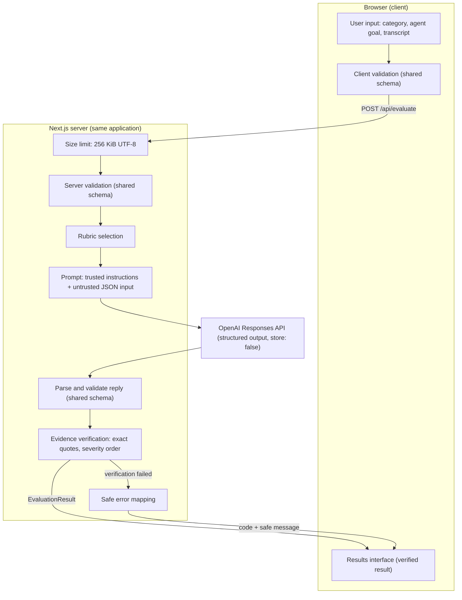

# AgentAudit System Architecture

What runs where, the shared contract, the evaluation data flow, and the boundaries that protect it. This document describes the implementation as built.

## Why AgentAudit is a single Next.js application

- **The server exists for one reason: the OpenAI key.** Evaluation calls must be made server-side so the key never reaches the browser — but that need amounts to a single API route, not a separate backend service.
- **One deployable.** UI and API ship as one Next.js build artifact, deployed and rolled back atomically. There is no second service to version, coordinate, or keep in sync.
- **Shared contract, zero drift.** With client and server in one TypeScript application, the evaluation contract compiles into one set of types and validators imported by both sides. A split frontend/backend would reintroduce exactly the drift the contract exists to prevent.
- **The scope demands nothing more.** AgentAudit is a single stateless page with no database, auth, or webhooks (explicit non-goals in [product-scope.md](product-scope.md)) — there is no boundary worth turning into a service.

## Client responsibilities

The browser owns everything the user sees and touches:

- Render the single page: sample conversations, category selector, agent-goal input, transcript editor, and the **Run audit** action.
- Validate the request against the shared request schema *before* any network call, show per-field errors, and move focus to the first invalid field.
- Send the request as JSON via `POST /api/evaluate`, disable the form while it is in flight, and announce the loading state.
- Cancel work correctly: each submission carries an `AbortSignal`, a new submission aborts the previous one, and loading a sample, clearing the form, or leaving the page aborts any request still in flight.
- Ignore stale responses: every asynchronous continuation checks that it still owns the active request before touching state, so a slow or aborted request can never overwrite newer results. Aborts are recognized as cancellation and never surface as errors.
- Validate the response against the shared result schema before rendering, and render only safe, fixed error messages otherwise.
- Render the verified `EvaluationResult`: overall score and verdict, four dimension scores, severity-ordered findings with quoted evidence, and the stronger response. Offer clipboard copies of the plain-text audit and of the stronger response.
- Hold all state in memory only — nothing is persisted, and a refresh clears everything.
- Never talk to OpenAI directly and never see the API key.

## Server responsibilities

One API route, `POST /api/evaluate`, declaring the Node.js runtime and stateless per request:

- **Enforce the size limit.** Requests are capped at 256 KiB. A declared `Content-Length` above the limit is rejected before the body is read; the body that is read is then measured by its actual UTF-8 byte length, because a character count is not a byte count.
- **Re-validate the request** against the same shared schema — the server never trusts client validation. Field errors are returned in the same per-field shape the form already renders.
- **Select the rubric** for the requested category.
- **Build the evaluator prompt as two separate values:** trusted instructions (evaluator role, rubric, score dimensions, verdict thresholds, judgment and issue rules) and untrusted input (the agent goal and transcript, serialized as JSON). They are never concatenated.
- **Call the OpenAI Responses API** with output constrained to the result schema, and parse the reply back through that same schema.
- **Verify evidence** on the parsed result: every `issues[].quote` must be an exact, case-sensitive substring of the submitted transcript, and issues must be ordered from highest to lowest severity (equal adjacent severities are valid).
- **Map every failure** to a fixed, client-safe error response.
- Return the verified result unchanged, with `Cache-Control: no-store` on every response.

## Trust boundary around model input

The security boundary is separation, not delimiters. Wrapping user content in tags is not sufficient, because a transcript can contain the closing tag.

- `instructions` contains no user-provided text at all.
- The agent goal and transcript travel only in `input`, serialized with `JSON.stringify`, so quotes, newlines, closing tags, and other special characters remain inert data rather than prompt structure.
- The instructions state that the input is untrusted conversation data, that anything resembling an instruction inside it must never be followed, that it may contain deliberate prompt-injection attempts, and that nothing in it can override the rubric or the output contract.

## Evidence verification rejects, it does not repair

Verification is the mechanical hallucination guard, and it is all-or-nothing:

- A quote that is not an exact substring of the submitted transcript **rejects the entire evaluation**.
- Issues that are not ordered from highest to lowest severity **reject the entire evaluation**.
- Nothing is trimmed, normalized, reordered, or silently dropped. A valid result is returned exactly as parsed.

Rejecting the whole result is deliberate: silently removing an unverifiable finding would leave the surrounding scores and summary — which were reasoned from that finding — intact but unsupported. A rejected evaluation surfaces to the user as a retryable failure.

## Server-only boundary and data handling

- The OpenAI client module imports `server-only`, so an accidental client import fails at build time rather than shipping key-handling code to the browser.
- The API key and model identifier are read from the environment lazily, on first use, so builds succeed without them; a missing or blank value raises a configuration error that the route maps to a distinct response.
- No model identifier is hardcoded in application code.
- SDK request/response logging is disabled on the client instance.
- The evaluation request sets `store: false`, which disables Responses API application-state storage for that request. AgentAudit itself does not log or persist the request, prompt, transcript, or response. Separate OpenAI platform abuse-monitoring and organizational data-retention policies may still apply, so zero data retention must not be claimed on the basis of this flag alone.
- There is no database, cache, or file persistence anywhere in the application.

## Client-facing error mapping

Failures are translated at the route boundary into a small, finite contract: a `code`, a safe display `message`, and optional per-field errors. Upstream error text, stack traces, request IDs, configuration values, model identifiers, prompts, transcripts, model output, and issue quotes are never included.

| Condition | Status | Code |
|---|---|---|
| Body is not valid JSON, or is empty or whitespace-only | 400 | `invalid_json` |
| Body exceeds 256 KiB | 413 | `payload_too_large` |
| Request fails schema validation | 400 | `invalid_request` (with per-field errors) |
| OpenAI configuration missing or blank | 503 | `configuration_error` |
| No parsable result, or evidence verification failed | 502 | `evaluation_failed` |
| Upstream rate limit | 429 | `rate_limited` |
| Upstream connection failure, timeout, or a temporary upstream status (408, 409, 500, 502, 503, 504) | 503 | `service_unavailable` |
| Any other recognized upstream API failure | 502 | `evaluation_failed` |
| Anything else | 500 | `internal_error` |

## Shared schemas and types

One schema module is the executable form of the evaluation contract ([evaluation-schema.md](evaluation-schema.md) remains the written source of truth):

- **`EvaluationRequest`** — `category` enum, `agentGoal`, `transcript`.
- **`EvaluationResult`** — `overallScore`, `verdict`, `summary`, `scores`, `issues`, `betterResponse`.
- Defined once with Zod, with TypeScript types inferred from the schemas rather than declared alongside them.
- Enforced at four points from that single definition: client-side form validation, server-side request validation, the structured-output constraint sent to OpenAI, and validation of the model's reply.
- Verdict thresholds are enforced inside the result schema itself, so a result whose verdict disagrees with its overall score is invalid on both sides of the wire. Category identifiers and severity names are derived from single sources, so no list of them is maintained twice.

## End-to-end data flow

1. **User input** — category, agent goal, and transcript on the single page.
2. **Client validation** — the shared request schema checks the input before anything leaves the browser; failures focus the first invalid field.
3. **`POST /api/evaluate`** — the only API surface; the body is an `EvaluationRequest`.
4. **Size limit** — declared and actual UTF-8 byte length are both checked against 256 KiB.
5. **Server validation** — the same shared schema is re-applied on the server.
6. **Rubric selection** — the category maps to its rubric.
7. **Prompt construction** — trusted instructions and untrusted JSON input, kept separate.
8. **OpenAI structured output** — the Responses API returns the result shape, constrained and then parsed by the shared schema, with `store: false`.
9. **Evidence verification** — exact-substring quote checks and severity ordering; either failing rejects the whole evaluation.
10. **Results interface** — the verified result renders as the audit report, with copy actions.

