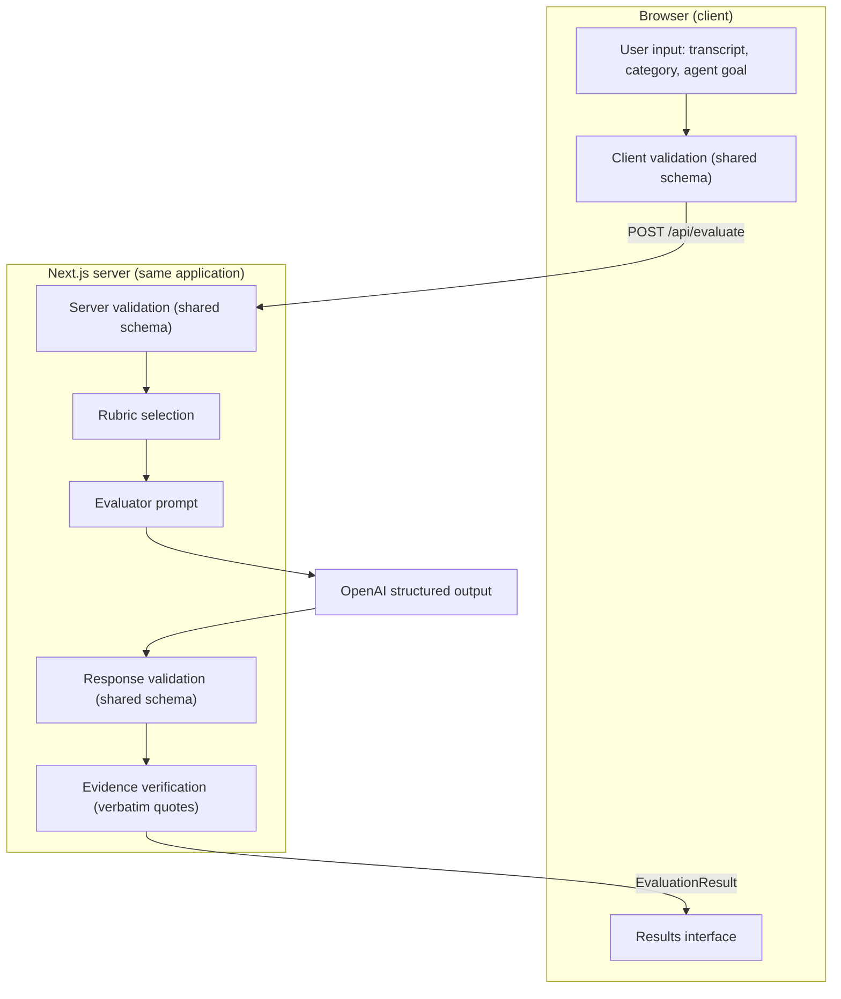

# AgentAudit System Architecture

What runs where, the shared contract, and the evaluation data flow. Security hardening, error handling, and the concrete file layout are documented separately.

## Why AgentAudit is a single Next.js application

- **The server exists for one reason at MVP scale: the OpenAI key.** Evaluation calls must be made server-side so the key never reaches the browser — but that need amounts to a single API route, not a separate backend service.
- **One deployable.** UI and API ship as one Next.js build artifact, deployed and rolled back atomically. There is no second service to version, coordinate, or keep in sync.
- **Shared contract, zero drift.** With client and server in one TypeScript application, the evaluation contract compiles into one set of types and validators imported by both sides. A split frontend/backend would reintroduce exactly the drift the contract exists to prevent.
- **The scope demands nothing more.** The MVP is a single stateless page with no database, auth, or webhooks (explicit non-goals in [product-scope.md](product-scope.md)) — there is no boundary worth turning into a service.

## Client responsibilities

The browser owns everything the user sees and touches:

- Render the single page: transcript input, category selector, agent-goal input, and the **Run Audit** action.
- Validate the evaluation request against the shared request schema *before* any network call — instant feedback, no wasted round-trips.
- Send the request as JSON via `POST /api/evaluate` and show a progress state while the evaluation runs.
- Render the validated `EvaluationResult`: verdict and overall score, the four sub-scores, severity-ordered issues with quotes, and the better response.
- Hold all state in memory only — nothing persisted, refresh clears everything (per scope).
- Never talk to OpenAI directly and never see the API key.

## Server responsibilities

One API route, `POST /api/evaluate`, stateless per request:

- Re-validate the incoming request against the same shared schema — the server never trusts client validation.
- Select the rubric for the requested category (the per-category emphasis from [product-scope.md](product-scope.md), operationalized as evaluator instructions).
- Compose the evaluator prompt from rubric + `agentGoal` + `transcript`, embedding the contract's validation decisions as instructions.
- Call OpenAI with structured output constrained to the `EvaluationResult` schema, so the model returns the contract shape rather than free-form text to parse.
- Validate the model's response at runtime: integer scores in range, verdict consistent with the thresholds, issues ordered by severity.
- Verify evidence: check that every `issues[].quote` is a verbatim substring of the submitted transcript, dropping any finding that fails — the mechanical hallucination guard from [evaluation-schema.md](evaluation-schema.md).
- Return the validated result to the client.

## Shared schemas and types

One schema module is the executable form of the evaluation contract ([evaluation-schema.md](evaluation-schema.md) remains the source of truth):

- **`EvaluationRequest`** — `category` enum, `agentGoal`, `transcript`.
- **`EvaluationResult`** — `overallScore`, `verdict`, `summary`, `scores`, `issues`, `betterResponse`.
- Defined once as runtime validators with inferred TypeScript types (a runtime schema library such as Zod, which also generates the structured-output constraint).
- Enforced at four points from a single definition: client form validation, server request validation, the structured-output constraint sent to OpenAI, and server response validation.
- Verdict thresholds and severity ordering live beside the schemas as shared constants, so client and server can never compute them differently.

## End-to-end data flow

1. **User input** — the user pastes a transcript, selects a category, and states the agent's goal on the single page.
2. **Client validation** — the shared request schema checks shape and presence before anything leaves the browser.
3. **`POST /api/evaluate`** — the only API surface; the request body is an `EvaluationRequest`.
4. **Server validation** — the same shared schema is re-applied on the server.
5. **Rubric selection** — the category maps to its rubric emphasis.
6. **Evaluator prompt** — rubric, goal, and transcript are composed into evaluator instructions.
7. **OpenAI structured output** — the model responds in the `EvaluationResult` shape, schema-constrained.
8. **Response validation** — runtime re-check of ranges, verdict thresholds, and severity ordering.
9. **Evidence verification** — every issue quote is substring-checked against the submitted transcript; unverifiable findings are dropped per the contract.
10. **Results interface** — the validated result renders as the audit report.

